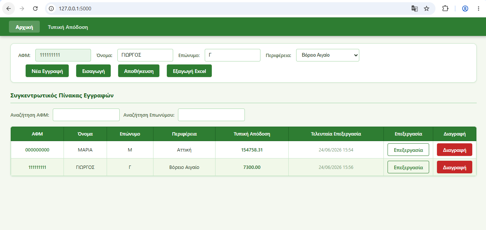
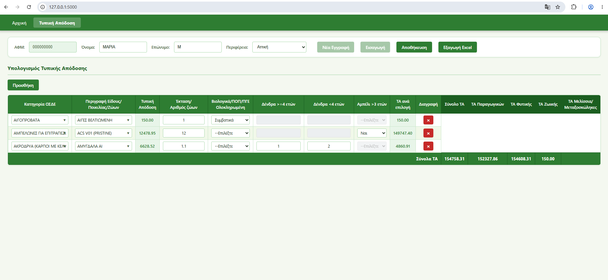

# ΠΑΑ App Web

[](https://github.com/marakik05/paa_app_web/actions/workflows/tests.yml)
[](https://github.com/marakik05/paa_app_web/actions/workflows/security.yml)

Web εφαρμογή για Έλληνες γεωτεχνικούς μελετητές με σκοπό τον υπολογισμό της τυπικής απόδοσης υποψήφιων παραγωγούν που επιθυμούν να υποβάλλουν αίτηση στήριξης στις Παρεμβάσεις του **ΠΑΑ 2023-2027**.


## Περιεχόμενα

- [Λειτουργίες](#λειτουργίες)
- [Screenshots](#screenshots)
- [Τεχνολογίες](#τεχνολογίες)
- [Εγκατάσταση](#εγκατάσταση)
- [Εκτέλεση](#εκτέλεση)
- [Tests](#tests)
- [Δομή Project](#δομή-project)
- [API](#api)
- [Επικοινωνία](#-επικοινωνία)
- [License](#-license)

## Λειτουργίες

- 📋 Συγκεντρωτικός πίνακας παραγωγών με αναζήτηση/φιλτράρισμα (ΑΦΜ, Επώνυμο)
- 🧮 Υπολογισμός Τυπικής Απόδοσης (ΤΑ)  ανά ΑΦΜ, βάσει κατηγορίας ΟΣΔΕ, περιφέρειας και χαρακτηριστικών εκμετάλλευσης
- 📥 Εισαγωγή δεδομένων από αρχείο **xlsx** με έλεγχο συγκρούσεων (conflicts) ανά ΑΦΜ
- 📤 Εξαγωγή δεδομένων ΤΑ σε **xlsx**
- 💾 Αποθήκευση σε τοπική βάση **SQLite**

## Screenshots

### Συγκεντρωτικός πίνακας παραγωγών


### Πίνακας υπολογισμού ΤΑ


## Τεχνολογίες

| Layer | Τεχνολογία |
|-------|------------|
| Backend | Python 3.x + Flask |
| Frontend | JavaScript, HTML, CSS|
| Storage | SQLite (`database_manager.py`) |
| Reference data | `data/ta.xlsx` (φορτώνεται μέσω `openpyxl`) |

## Εγκατάσταση

```bash
git clone https://github.com/marakik05/paa_app_web.git
cd paa_app_web
python -m venv venv
venv\Scripts\activate        # Windows
pip install -r requirements.txt
```

## Εκτέλεση

```bash
python server.py
```

Η εφαρμογή θα είναι διαθέσιμη στο [http://127.0.0.1:5000](http://127.0.0.1:5000).

Η βάση δεδομένων αποθηκεύεται στο `%LOCALAPPDATA%\PaaApp_web\paa_app_web.db`.

## Tests

```bash
pip install -r requirements-dev.txt
python -m unittest discover -s tests -v
```

- Τα e2e tests (`tests/test_frontend_e2e.py`) βασίζονται σε Playwright και παραλείπονται αυτόματα αν δεν υπάρχει εγκατεστημένο (`pip install playwright && playwright install chromium`).
- Στο CI τρέχουν αυτόματα:
  - **tests.yml** — `unittest discover` σε κάθε push/PR
  - **security.yml** — Bandit + pip-audit σε κάθε push/PR και κάθε Δευτέρα

## Δομή Project

```
paa_app_web/
├── server.py                  # Flask routes + startup
├── database_manager.py        # SQLite operations
├── utils/
│   ├── excel_loader.py        # Φόρτωση ta.xlsx, constants
│   ├── ta_calculations.py     # Υπολογισμοί ΤΑ
│   └── import_utils.py        # Canonicalization/validation/import xlsx
├── templates/
│   ├── index.html
│   └── partials/
├── static/
│   ├── main_window.js
│   ├── section_arxiki.js
│   ├── section_ta.js
│   ├── messages.js
│   └── *.css
├── data/
│   └── ta.xlsx                # Reference data (τυπικές αποδόσεις)
└── tests/
```

## API

| Method | Route | Περιγραφή |
|--------|-------|-----------|
| `GET` | `/` | Render index.html |
| `GET` | `/api/regions` | Λίστα περιφερειών |
| `GET` | `/api/producer/<afm>/exists` | Έλεγχος αν υπάρχει ΑΦΜ |
| `GET` | `/api/producer/<afm>/full` | Δεδομένα παραγωγού + ΤΑ γραμμές |
| `POST` | `/api/producer/<afm>/save` | Αποθήκευση παραγωγού + ΤΑ |
| `DELETE` | `/api/producer/<afm>` | Διαγραφή παραγωγού |
| `GET` | `/api/producers` | Όλοι οι παραγωγοί |
| `GET` | `/api/ta/reference` | TA mapping |
| `POST` | `/api/ta/recalculate` | Επανυπολογισμός ΤΑ γραμμών |
| `POST` | `/api/import/parse` | Parse xlsx → new_data + conflicts |
| `POST` | `/api/import/execute` | Εκτέλεση import με αποφάσεις |
| `POST` | `/api/producer/<afm>/export` | Export ΤΑ σε xlsx |

## 📬 Επικοινωνία

Για οποιαδήποτε ερώτηση ή σχόλιο, μπορείτε να ανοίξετε ένα issue στο repository.

## 📄 License

Διανέμεται υπό την **PolyForm Noncommercial License 1.0.0**. Επιτρέπεται η λήψη, προβολή, τοπική εκτέλεση και τροποποίηση του κώδικα **αποκλειστικά για μη-εμπορικούς σκοπούς**. Κάθε εμπορική χρήση απαιτεί ξεχωριστή άδεια. Δείτε το αρχείο [LICENSE](LICENSE) για λεπτομέρειες.

